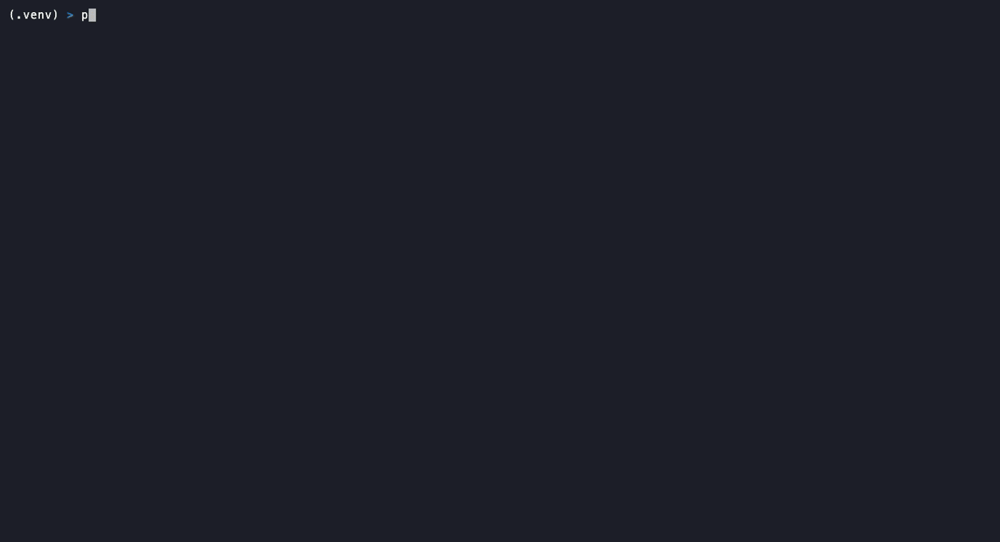

<div align="center">

# Portscout

### A friendly, graphical terminal UI for [nmap](https://nmap.org/)

Point, press a key, and scan — with real-time progress bars, live logs, desktop
notifications, and a clean [hexagonal architecture](#architecture) under the hood.

[](LICENSE)
[](https://www.python.org/)
[](https://textual.textualize.io/)
[](CONTRIBUTING.md)
[](https://buymeacoffee.com/edggdev)

</div>

---

> **Responsible use.** Portscout is a front-end for nmap intended for **authorized**
> network administration, security auditing, and education only. Scanning systems you
> do not own or lack written permission to test may be illegal in your jurisdiction.
> You accept full and sole responsibility for your use of this tool. See
> [`DISCLAIMER.md`](DISCLAIMER.md). The application performs no scan until you have
> read and accepted these terms on first launch.

## Overview

Portscout wraps the power of nmap in an approachable terminal user interface. It is
aimed at people who want nmap's capabilities without memorizing its flags, as well as
experienced users who appreciate a fast, keyboard-driven dashboard with live feedback.

It is also a small, readable reference implementation of the **ports and adapters
(hexagonal) architecture** in Python — the scanning core is completely decoupled from
nmap, the filesystem, and the UI framework.

## Features

- **Graphical TUI** built with [Textual](https://textual.textualize.io/); runs in any
  modern terminal.
- **Real progress bars** driven by nmap's own live statistics (the `About XX% done`
  timing lines), not a fake spinner.
- **Live logs** streamed line-by-line while the scan runs.
- **Notifications** for scan start, completion, errors, and missing dependencies.
- **Scan profiles** — ping sweep, quick, standard (service/version detection), full
  TCP with scripts and OS detection, and UDP top ports.
- **Live command preview** — see the exact `nmap` command that will run, updated as you
  type, before you launch it.
- **Results table** — hosts, ports, states, and detected services at a glance.
- **Configuration** — persisted to a TOML file; edit the nmap path, default profile,
  timeout, and output directory from within the app.
- **Selectable themes** — a dozen predefined themes (Nord, Gruvbox, Dracula, Tokyo
  Night, Catppuccin, Solarized, and more) that preview live and persist between runs.
- **Dependency doctor** — checks that nmap and libpcap/npcap are present and guides
  installation when they are not.
- **Clean hexagonal architecture** — the domain core has zero third-party imports and
  is fully unit-tested.

## Demo

<div align="center">


*Accept the responsible-use disclaimer, type a target, and watch the live progress,
streaming log, and results table.*

</div>

### More screens

<div align="center">

**Live input validation and command preview**



**Dependency doctor** &nbsp;·&nbsp; **Settings**


**Selectable themes with live preview**


</div>

## Requirements

Portscout is a front-end, so it needs the `nmap` binary and its packet-capture library
installed on your system:

| Platform | Install command |
| --- | --- |
| macOS | `brew install nmap` (bundles libpcap) |
| Debian / Ubuntu | `sudo apt install nmap libpcap0.8` |
| Fedora / RHEL | `sudo dnf install nmap libpcap` |
| Arch | `sudo pacman -S nmap libpcap` |
| Windows | Install [Nmap](https://nmap.org/download.html) and [Npcap](https://npcap.com/) |

Plus **Python 3.11 or newer**.

## Installation

From source (recommended while pre-release):

```bash
git clone https://github.com/edglz/portscout.git
cd portscout
python -m venv .venv && source .venv/bin/activate   # Windows: .venv\Scripts\activate
pip install -e .
portscout
```

Or run without installing:

```bash
pip install -r requirements.txt
python -m portscout
```

> Privileged profiles (full TCP SYN scan, UDP scan) require raw sockets. Launch with
> `sudo portscout` on Linux/macOS, or run as Administrator on Windows, to use them.

## Keyboard shortcuts

| Key | Action |
| --- | --- |
| `Enter` | Start scan (while the target/ports field is focused) |
| `s` | Start scan (when no text field is focused) |
| `x` | Stop the running scan |
| `c` | Open settings |
| `d` | Show dependency status |
| `Ctrl+L` | Clear the log |
| `q` | Quit |

## Configuration

Settings are stored in a TOML file (its exact path is shown in the in-app settings
screen):

- Linux / macOS: `~/.config/portscout/config.toml`
- Windows: `%APPDATA%\portscout\config.toml`

```toml
default_profile = "standard"
nmap_path = "nmap"
output_dir = "~/scans"     # if set, each scan's raw XML is written here
timeout_seconds = 600
theme = "textual-dark"
disclaimer_accepted = true
```

## Architecture

Portscout follows the **hexagonal (ports and adapters)** pattern. The business core
never imports a framework or spawns a subprocess; it depends only on abstract *ports*.
Concrete *adapters* implement those ports and are wired together in a single
composition root.

```
src/portscout/
├── domain/          Pure core: value objects, entities, port interfaces (no third-party deps)
│   ├── value_objects.py   Target, PortSpec, ScanProfile (self-validating)
│   ├── entities.py        ScanRequest, Host, Port, Service, ScanResult
│   └── ports.py           ScannerPort, ConfigPort, DependencyCheckerPort
├── application/     Use cases orchestrating the domain through the ports
│   └── services.py        ScanService, ConfigService, DependencyService
├── infrastructure/  Adapters implementing the ports (the driven side)
│   ├── nmap_adapter.py    Runs nmap and parses its XML        -> ScannerPort
│   ├── config.py          TOML persistence                    -> ConfigPort
│   └── dependencies.py    System dependency detection         -> DependencyCheckerPort
├── presentation/    Textual TUI (the driving side)
│   ├── app.py             Widgets, worker threads, progress, notifications
│   ├── screens.py         Disclaimer / Settings / Dependencies modal screens
│   └── styles.tcss        Styling
└── bootstrap.py     Composition root: the only place adapters are instantiated
```

**Why it matters.** You could swap nmap for `masscan`, or TOML for a database, by
writing one new adapter and changing `bootstrap.py` — nothing in `domain/` or
`application/` would change. The same decoupling is what makes the core trivial to
unit-test without touching the network.

### Data flow of a scan

1. The TUI collects raw input (target, profile, ports) and asks `ScanService` to build
   a validated `ScanRequest`. Invalid input is rejected by the value objects before any
   process is spawned.
2. `ScanService` delegates to whatever `ScannerPort` was injected — here, `NmapAdapter`.
3. `NmapAdapter` invokes nmap with an argument list (never a shell string), streams its
   output back through a progress callback, and parses the resulting XML into domain
   entities.
4. The TUI renders progress and, on completion, the `ScanResult` table.

## Security notes

- nmap is always invoked with an argument **list** and never `shell=True`, and the
  target is validated by the `Target` value object first, so there is no
  shell-injection surface.
- Portscout never elevates privileges silently. Privileged profiles fail with a clear
  message asking you to relaunch with elevated permissions.

## Development

```bash
pip install -e ".[dev]"
pytest            # run the test suite
ruff check .      # lint
mypy              # type-check
textual run --dev portscout.presentation.app:PortscoutApp   # hot-reload dev mode
```

## Contributing

Contributions are very welcome. Please read [`CONTRIBUTING.md`](CONTRIBUTING.md) and the
[Code of Conduct](CODE_OF_CONDUCT.md) before opening a pull request. Issues labeled
[`good first issue`](https://github.com/edglz/portscout/labels/good%20first%20issue) are
a good place to start.

If Portscout is useful to you, please consider starring the repository — it genuinely
helps the project reach more people.

## Support

If Portscout saves you time, you can support its development:

<a href="https://buymeacoffee.com/edggdev">
  
</a>

Starring the repository also helps a lot.

## License

[MIT](LICENSE) © Portscout contributors.

## Acknowledgements

- [nmap](https://nmap.org/) — the engine this is a friendly face for.
- [Textual](https://textual.textualize.io/) — the TUI framework.
